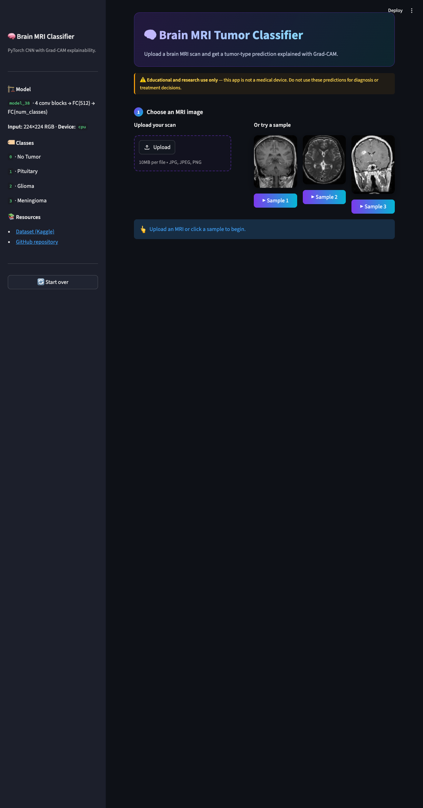
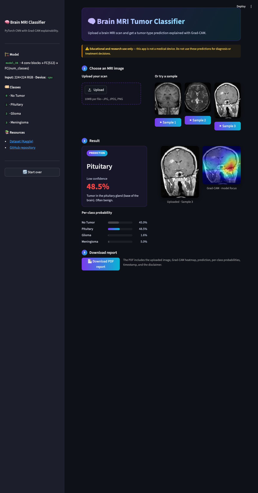

# 🧠 Brain MRI Tumor Classifier

[](https://opensource.org/licenses/MIT)
[](pyproject.toml)
[](https://streamlit.io)
[](https://pytorch.org)
[](https://docs.astral.sh/uv/)

A polished, portfolio-grade Streamlit app that classifies brain MRI scans into
**No Tumor**, **Pituitary**, **Glioma**, or **Meningioma** using a custom
PyTorch CNN, and explains every prediction with a **Grad-CAM** heatmap.

> ⚠️ **For educational and research use only.** This app is not a medical
> device. Do not use these predictions for diagnosis or treatment decisions.

---

## ✨ Features

- 🎯 **4-class tumor classification** — No Tumor, Pituitary, Glioma, Meningioma
- 🔥 **Grad-CAM heatmap overlay** — see which MRI regions the model focused on
- 📊 **Per-class probability bar chart** — full confidence breakdown, not just the top label
- 🖼️ **One-click sample images** — try the app instantly without finding your own MRI
- 📄 **PDF report download** — original image, heatmap, prediction, probabilities, disclaimer
- 🌙 **Dark theme** out of the box
- 🐳 **Dockerized** for reproducible deploys
- 📦 **uv + `pyproject.toml`** — modern Python packaging, locked deps

## 🚀 Live demo

| Platform | Link |
|----------|------|
| Hugging Face Spaces | <!-- TODO: paste URL after first deploy --> |
| Streamlit Community Cloud | <!-- TODO: paste URL after first deploy --> |

## 🖼️ Screenshots

> Capture these after your first run and commit them under `docs/`.
> See [docs/SCREENSHOTS.md](docs/SCREENSHOTS.md) for the shot list.

| Main view | Grad-CAM result |
|-----------|-----------------|
|  |  |

## 🏃 Quickstart

Requires [`uv`](https://docs.astral.sh/uv/getting-started/installation/)
(`brew install uv` on macOS).

```bash
git clone https://github.com/HalemoGPA/BrainMRI-Tumor-Classifier-Pytorch.git
cd BrainMRI-Tumor-Classifier-Pytorch
uv sync
uv run streamlit run app.py
```

Open <http://localhost:8501> and either upload an MRI or click a sample.

### Run with Docker

```bash
docker build -t brain-mri .
docker run -p 8501:8501 brain-mri
```

## 🧠 Model

A compact CNN trained on the
[Brain Tumor MRI Dataset](https://www.kaggle.com/datasets/masoudnickparvar/brain-tumor-mri-dataset).

| Component | Spec |
|-----------|------|
| Input | 224×224 RGB, ImageNet normalization |
| Backbone | 4 × (Conv → BatchNorm → ReLU → MaxPool) |
| Head | Flatten → FC(512) → Dropout(0.5) → FC(num_classes) |
| Parameters | ~2.7 M |
| Weights file | [`models/model_38`](models/model_38) (11 MB) |

Training notebook: [`notebooks/`](notebooks/).

## 📂 Project layout

```
.
├── app.py                       # Streamlit entry point
├── src/
│   ├── model.py                 # CNN definition + checkpoint loader
│   └── utils.py                 # predict, Grad-CAM, PDF report helpers
├── models/model_38              # trained weights (committed)
├── sample/                      # 3 sample MRIs for the "Try a sample" buttons
├── notebooks/                   # training + evaluation notebooks
├── .streamlit/config.toml       # dark theme + server config
├── pyproject.toml               # canonical dependency spec (uv)
├── requirements.txt             # auto-generated via `uv export` (Streamlit Cloud)
├── runtime.txt                  # Python pin for Streamlit Cloud
├── Dockerfile                   # for HF Spaces / any container host
└── huggingface-space.md         # HF Spaces deploy guide
```

## ☁️ Deployment

### Hugging Face Spaces

See [huggingface-space.md](huggingface-space.md) for the full step-by-step
using the modern `hf` CLI.

### Streamlit Community Cloud

1. Push the repo to GitHub.
2. Go to <https://share.streamlit.io>, **New app**, point at `app.py`.
3. The app reads `requirements.txt` (auto-generated from `pyproject.toml`)
   and `.streamlit/config.toml` automatically.

To regenerate `requirements.txt` after editing `pyproject.toml`:

```bash
uv export --no-hashes --no-dev --no-emit-project -o requirements.txt
```

## 📜 License

[MIT](LICENSE)

## 🙏 Acknowledgments

- Dataset by [Masoud Nickparvar](https://www.kaggle.com/datasets/masoudnickparvar/brain-tumor-mri-dataset)
- Grad-CAM via [`pytorch-grad-cam`](https://github.com/jacobgil/pytorch-grad-cam)
